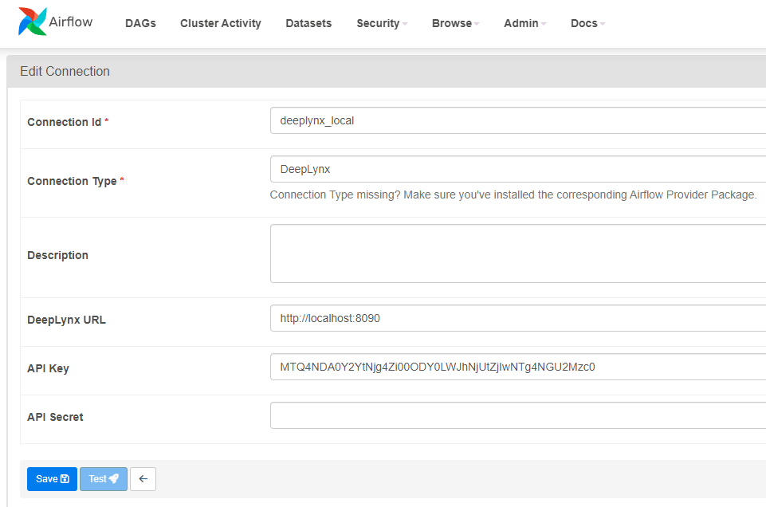

# DeepLynx-Airflow-Provider
This custom [Airflow provider package](https://airflow.apache.org/docs/apache-airflow-providers/) allows you to create Airflow tasks that interact with the [DeepLynx](https://github.com/idaholab/Deep-Lynx) data warehouse. Utilizing operators specifically designed for DeepLynx, this package enables seamless integration and communication between Airflow and DeepLynx, facilitating data management and processing workflows.

## Installation
### Install from PyPI
(coming soon) To install the provider package from PyPI, simply run:

```sh
pip install airflow-provider-deeplynx
```
### Install locally
- Clone the repository to your local machine.
- Navigate to the cloned repository directory: `cd airflow-provider-deeplynx`
- Install the package using pip: `pip install .`
  - for development, you can install in editable mode with `pip install -e .`

### Environment Variables
This package uses some environment variables for configuration. The environment variables should be set and available where your Airflow instance is running.
- `SSL_CERT_FILE`: This should be the Airflow accessible path to the file containing the INL SSL certificate authority. This may be needed depending on your DeepLynx instance's setup [DeepLynx Authentication Methods](https://github.com/idaholab/Deep-Lynx/wiki/Authentication-Methods).
- `DEEPLYNX_DATA_TEMP_FOLDER`: This is the Airflow environment path for where data is downloaded. If no value is set, this defaults to `AIRFLOW_HOME/logs/data`.

## Usage
Typical communication with DeepLynx requires a bearer token, so the first task of a DeepLynx DAG is usually to generate a token, which can be done with `GetOauthTokenOperator`. Once a token is generated using this operator, it can be passed to downstream tasks using [XComs](https://airflow.apache.org/docs/apache-airflow/stable/core-concepts/xcoms.html#xcoms), the token generation `task_id`, and the key `token`. `GetOauthTokenOperator` requires either a `conn_id` of an Airflow [Connection](https://airflow.apache.org/docs/apache-airflow/stable/authoring-and-scheduling/connections.html#connections-hooks) of type DeepLynx, or the parameters `host`, `api_key`, and `api_secret`. It is recommended to create a new Airflow connection of type DeepLynx through the [Airflow UI](https://airflow.apache.org/docs/apache-airflow/stable/howto/connection.html#creating-a-connection-with-the-ui), and input values for `DeepLynx URL`, `API Key`, and `API Secret`. You can then use this DeepLynx connection's id to set the
`conn_id` for any airflow operators in this package (alternatively, you can supply the `host` parameter).
Navigate to the Connections page with Admin -> Connections.


Most functionality can be understood by looking at the provided [Example Dags](deeplynx_provider/example_dags). Class level documentation is also provided.

### Example DAGs
Example DAGs are provided in [`deeplynx_provider/example_dags`](deeplynx_provider/example_dags). Copy the full directory into your airflow [`DAG_FOLDER`](https://airflow.apache.org/docs/apache-airflow/stable/core-concepts/dags.html#loading-dags) to have them loaded into your airflow environment.

#### [deeplynx_provider_test](deeplynx_provider/example_dags/deeplynx_provider_test.py)
A functional test DAG for the `airflow-provider-deeplynx` package. Users should create a DeepLynx connection in Airflow with `URL`, `API Key`,
and `API Secret`. To run the DAG, supply the DeepLynx `connection_id`, optionally create a new `container_name`, and keep `data_source_name` as `TC-201`.
This DAG will:
- check if the supplied `container_name` exists and retrieve the `container_id` if so; if that container name does not exist, it will create a new container with the supplied name.
- import container ontology and typemappings from [Container_Export.json](deeplynx_provider/example_dags/data/Container_Export.json)
- set the data source active (named `TC-201`)
- import timeseries data
- query timeseries data using two different methods
- upload the timeseries data result

#### [deeplynx_config_upload_download](deeplynx_provider/example_dags/deeplynx_config_upload_download.py)
This DAG shows how you can use the `DeepLynxConfigurationOperator` to create a custom configuration for DeepLynx communication. It requires that you already have a DeepLynx container and data source created, and that you input your `connection_id`, `container_id`, and `data_source_id`.

#### [data_query](deeplynx_provider/example_dags/data_query.py)
This DAG shows all the package supported ways that you can query for metatypes, relationships, and how to perform a graph query. This example requires users to create a graph in DeepLynx, and then to edit the DAG file itself so that the query bodies, parameters, and properties match your given graph data.

#### [get_token_with_key_secret](deeplynx_provider/example_dags/get_token_with_key_secret.py)
This DAG shows how you can get a DeepLynx token using `GetOauthTokenOperator` by directly specifying `host`, `api_key`, and `api_secret` (instead of using `conn_id`)

### Class Documentation
Class documentation is available [here](deeplynx_provider/docs). It was generated using [pdoc](https://github.com/pdoc3/pdoc) and the command `pdoc --output-dir=docs deeplynx_provider` ran from the root of this project.

### DeepLynx Config
Communication with DeepLynx using this package can be configured with various options like SSL certificate and local file writing locations. Most of the time, the default DeepLynx config will work just fine, but to learn more continue reading.

The operators in this provider package use the [Deep Lynx Python SDK](https://github.com/idaholab/Deep-Lynx-Python-Package) to communicate with DeepLynx. The [DeepLynxConfigurationOperator](deeplynx_provider/operators/configuration_operator.py) can be used to set your (Configuration)[https://github.com/idaholab/Deep-Lynx-Python-Package/blob/main/deep_lynx/configuration.py] exactly how you want it, and this configuration is then passed to a task instance (XCom)[https://airflow.apache.org/docs/apache-airflow/stable/core-concepts/xcoms.html] so that downstream tasks derived from [DeepLynxBaseOperator](deeplynx_provider/operators/deeplynx_base_operator.py) can use this configuration.

#### DeepLynx Authentication
This package is setup to use [token](https://github.com/idaholab/Deep-Lynx/wiki/Authentication-Methods#token-token) authentication with DeepLynx, but other authentication methods are supported by setting the [DeepLynx Config](#deepLynx-config).

## Notes
### Gotchas
- If using this Airflow package in a Docker environment to talk to a Dockerized DeepLynx, you should likely set your Deeplynx host/url to `http://host.docker.internal:8090`.

### Other Documentation
- Airflow documentation on creating a custom provider [here](https://airflow.apache.org/docs/apache-airflow-providers/howto/create-custom-providers.html)
- airflow-provider-sample project [here](https://github.com/astronomer/airflow-provider-sample)

### Decision to not store token and token expiry
- (background) Airflow is designed so that all tasks in a given DAG should be able to run [independently](https://airflow.apache.org/docs/apache-airflow/stable/core-concepts/tasks.html)
- I originally wanted integrate token generation, storage, and updating in the DeepLynx Hook, making things easier for users. This was working out nicely until I realized its also bad practice to update values in Airflow's Connections table via a DAG run. Updating an Airflow Variable in a DAG run could be viable, but since we anticipate a given DAG to potentially have many users (possibly deeplynx airflow-app service users that register a given "workflow instance") keeping track of those Variables could be an issue. ["I agree that Variables are a useful tool, but when you have k=v pairs that you only want to use for a single run, it gets complicated and messy."](https://stackoverflow.com/questions/57062998/is-it-possible-to-update-overwrite-the-airflow-dag-run-conf)
- By not storing the generated token it makes many things much simpler. As long as a user generates a token (with long enough expiration) at the beginning of their DAG, they can just pass that to subsequent tasks as needed using [XComs](https://airflow.apache.org/docs/apache-airflow/stable/core-concepts/xcoms.html).
- Basically, I want to keep it simple and this is following Airflow best practices. ["The tasks should also not store any authentication parameters such as passwords or token inside them. Where at all possible, use Connections to store data securely in Airflow backend and retrieve them using a unique connection id."](https://airflow.apache.org/docs/apache-airflow/stable/best-practices.html#communication)
